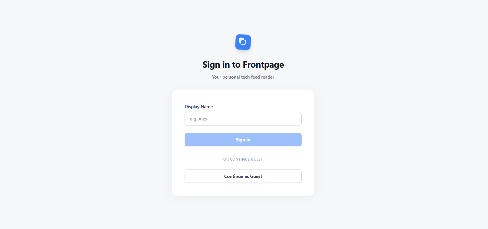
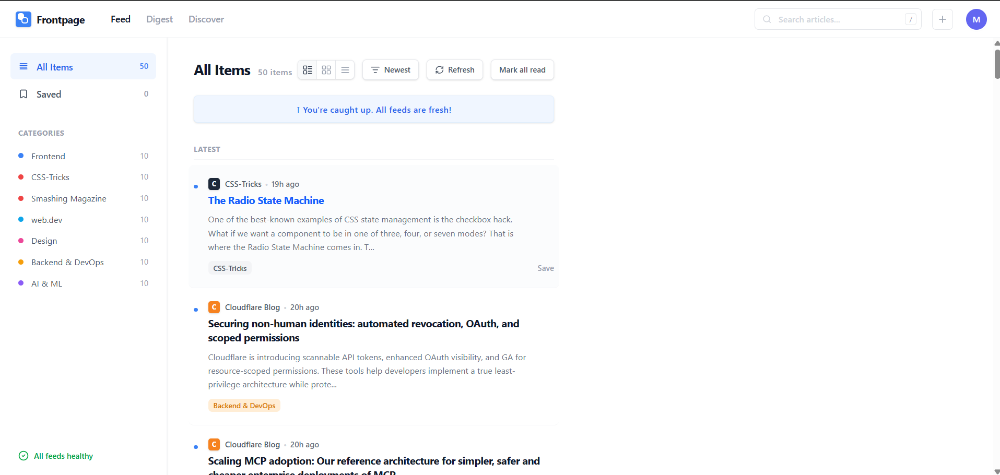

# 🚀 FrontPage Reader
FrontPage Reader is a responsive web application that allows users to read blogs and news from multiple sources in one place.

Built using modern frontend technologies, the application focuses on delivering a clean UI, smooth user experience, and efficient data handling.

# 📌 Overview
This project aggregates content from various developer blogs and news platforms using RSS feeds. Since RSS data is in XML format, the app integrates the RSS2JSON API to convert it into JSON, making it easy to consume in a React-based frontend


---

## 🚀 Live Demo

🔗 https://frontpage-reader.vercel.app

---


## 📸 Screenshots

### 🔐 Login Page


### 📰 Feed Page


---

## 📌 Features

* 🔐 **Login Authentication UI**
* 📰 **RSS Feed Integration**
* 🔄 **Real-time Feed Updates**
* 📱 **Responsive Design (Mobile + Desktop)**
* ⚡ **Fast Performance with Vite**
* 🧩 **Reusable React Components**
* 🎨 **Clean and Minimal UI**

---

🔄 How It Works

1. The app uses RSS feed URLs from multiple sources (e.g., blogs, tech sites).

2. These feeds provide data in XML format.

3. The RSS2JSON API converts XML → JSON.

4. The frontend fetches this JSON and renders articles dynamically.

---

## ⚙️ Tech Stack

* ⚛️ React
* 🟦 TypeScript
* ⚡ Vite
* 🎨 Tailwind CSS
* 🌐 REST API (RSS2JSON)

---

## 📂 Project Structure

```
frontend-reader/
│── public/              # Static assets
│── src/
│   ├── components/      # Reusable UI components
│   ├── pages/           # Application pages (Login, Feed)
│   ├── services/        # API / RSS handling logic
│   ├── App.tsx          # Main app component
│   └── main.tsx         # Entry point
│── index.html
│── package.json
```

---

## ⚙️ Installation & Setup

Follow these steps to run the project locally:

```bash
# Clone the repository
git clone https://github.com/auro342/frontpage-reader.git

# Navigate into the project
cd frontpage-reader

# Install dependencies
npm install

# Start development server
npm run dev
```

---

## 🧠 What I Learned

* Building scalable UI using **React + TypeScript**
* Managing components and state effectively
* Integrating external data (RSS feeds / APIs)
* Creating clean and responsive layouts
* Handling project structure in a real-world frontend app

---

## 🚧 Future Improvements

* 🔑 Add proper backend authentication
* ⭐ Bookmark / save articles feature
* 🌙 Dark mode support
* 🔍 Search and filter feeds
* 📡 Multiple RSS source support

---

## 👨‍💻 Author

**Aurobinda Mishra**
📧 [auromishra34@gmail.com]

---

## ⭐ Show Your Support

If you like this project, consider giving it a ⭐ on GitHub!
